Akıllı Sağlık Takip Sistemi — Flutter Mobil Uygulaması

Geliştirdiğim bu kapsamlı sağlık takip uygulaması, doktor ve hasta kullanıcılarına ayrı ayrı kişiselleştirilmiş deneyimler sunarak sağlık yönetimini kolaylaştırmayı hedeflemektedir.

Hasta Paneli Özellikleri:

Profil Yönetimi: Kişisel ve sağlık bilgileri kolayca güncellenebilir.

Randevu Sistemi: Kayıtlı doktorlar arasından seçim yapılarak hızlı ve detaylı randevu oluşturma.

İlaç Takibi: Belirlenen ilaç saatlerinde anlık bildirimler ile hatırlatma.

Anlık Sohbet: Hasta ve doktorlar arasında güvenli birebir iletişim.

Doktor Paneli Özellikleri:

Günlük Planlama: Hasta randevuları ve günlük iş akışı yönetimi.

Randevu Detayları: Saat bazlı ve hasta bilgileriyle zenginleştirilmiş liste görünümü.

Sohbet Modülü: Hastalarla etkili iletişim imkanı.

Teknoloji ve Mimari:

Firebase Auth & Cloud Firestore: Güçlü kimlik doğrulama ve gerçek zamanlı veri senkronizasyonu.

Firebase Storage: Medya ve profil görsellerinin güvenli depolanması.

Hive: Lokal veri yönetimi ile performans optimizasyonu.

Flutter Local Notification: Zamanında ilaç hatırlatmaları.

Yazılım Mimarisi: Clean Architecture prensipleriyle modüler ve sürdürülebilir yapı.

Dependency Injection & Cubit: Yüksek performanslı ve ölçeklenebilir state management.

📱 Hasta Paneli

  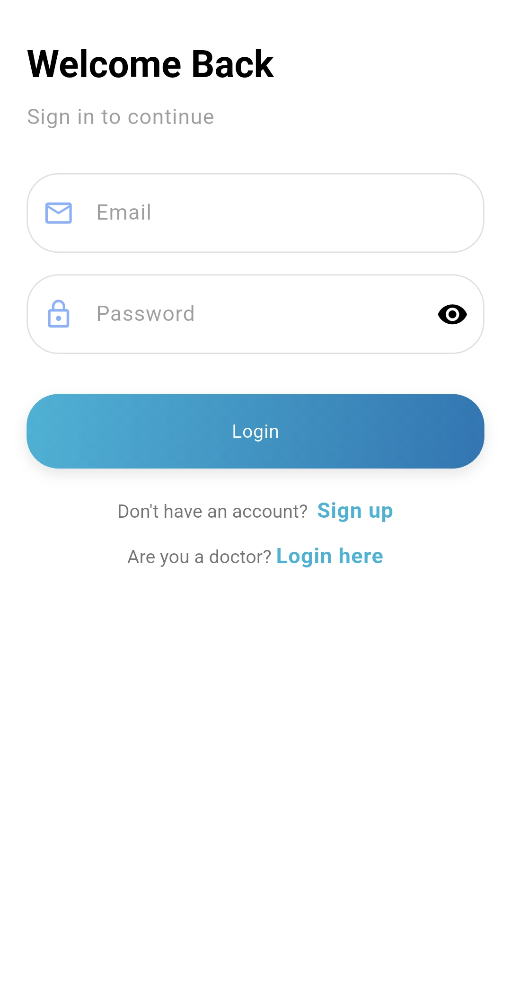
  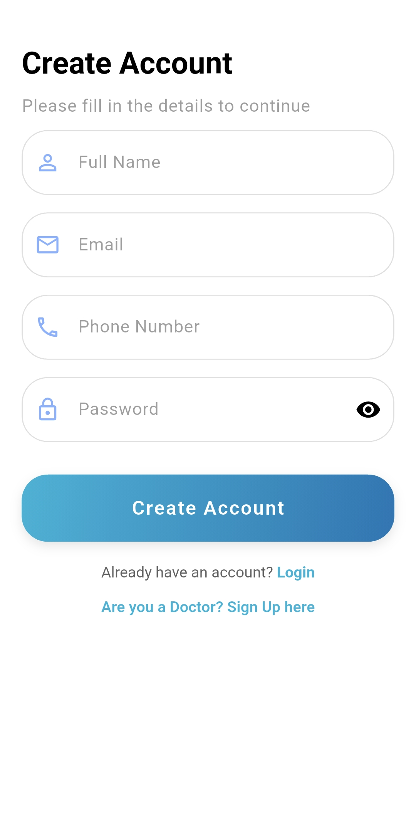
  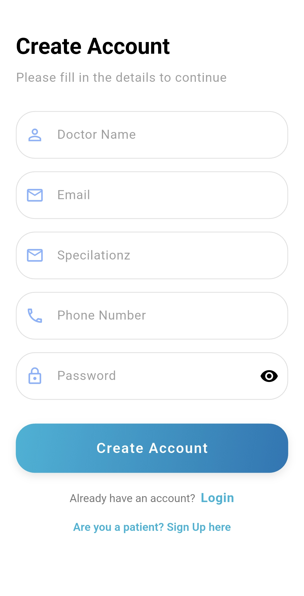
  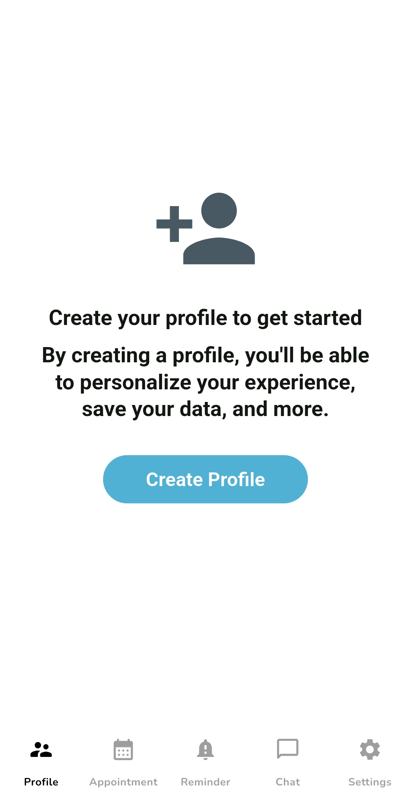
  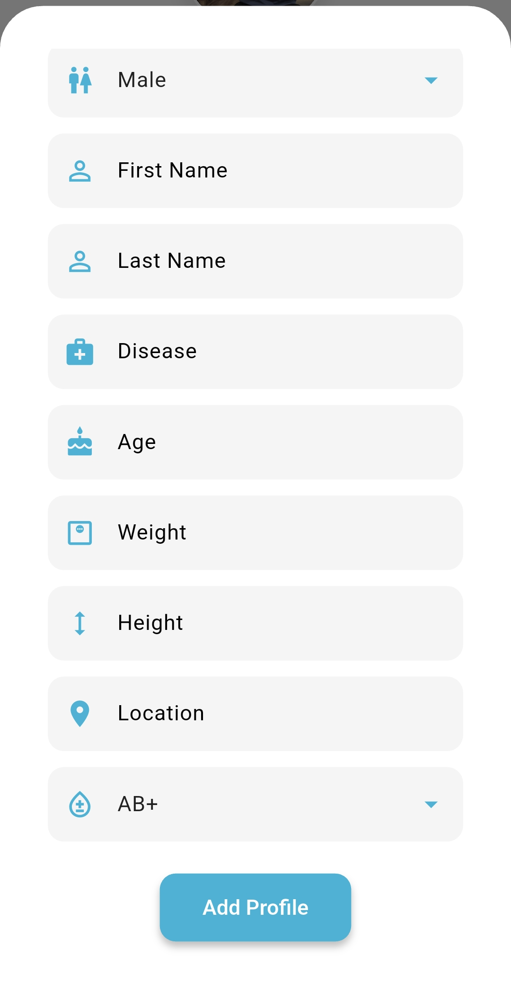
  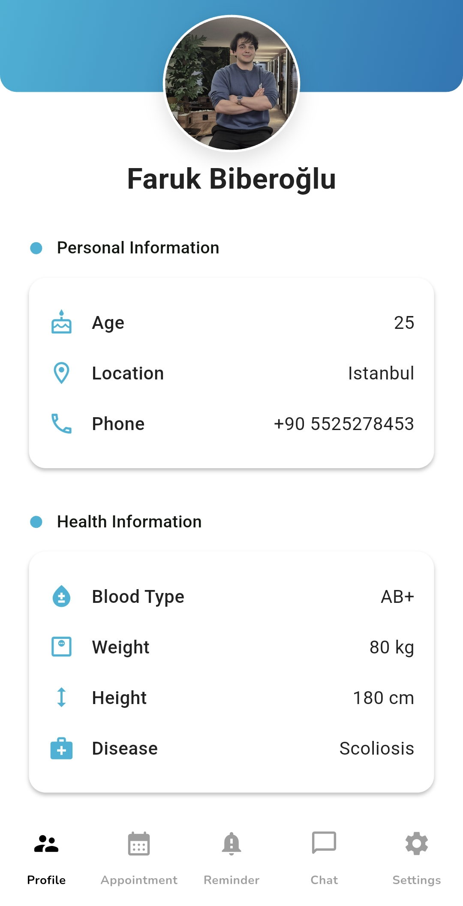
  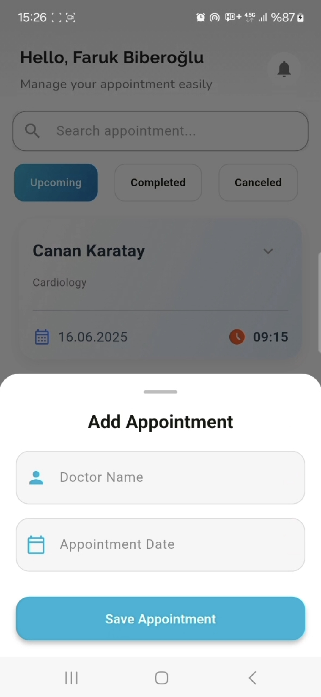
  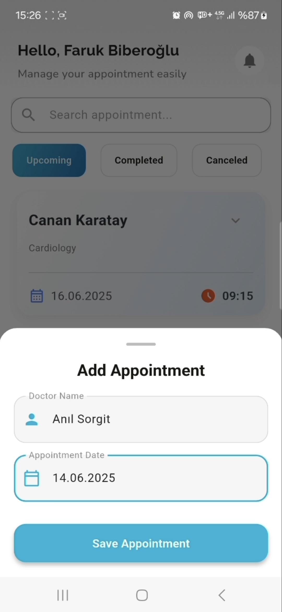
  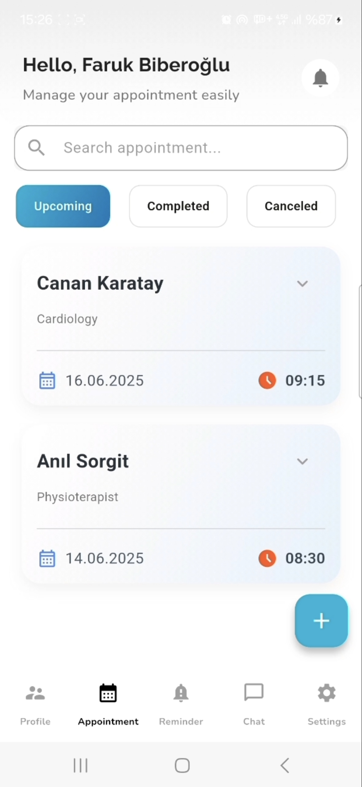
  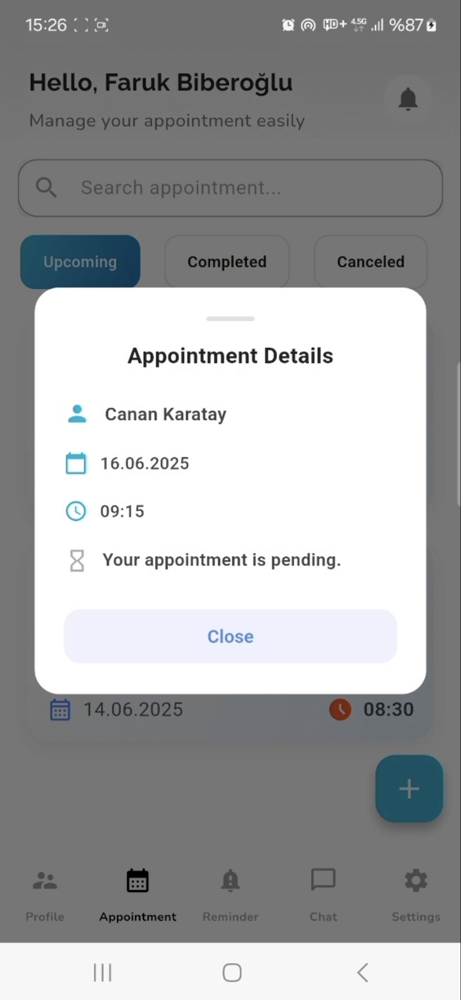
  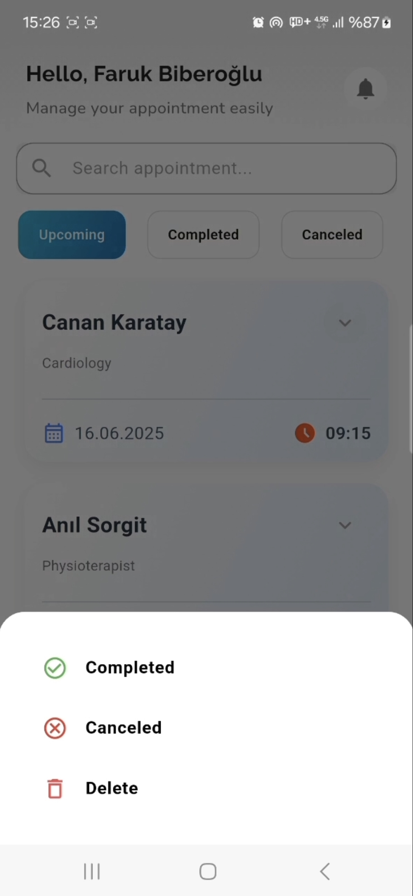
  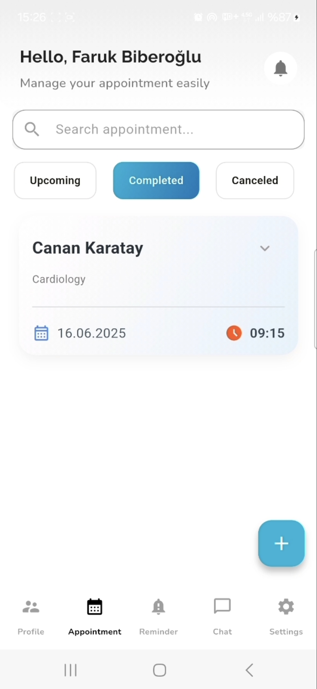
  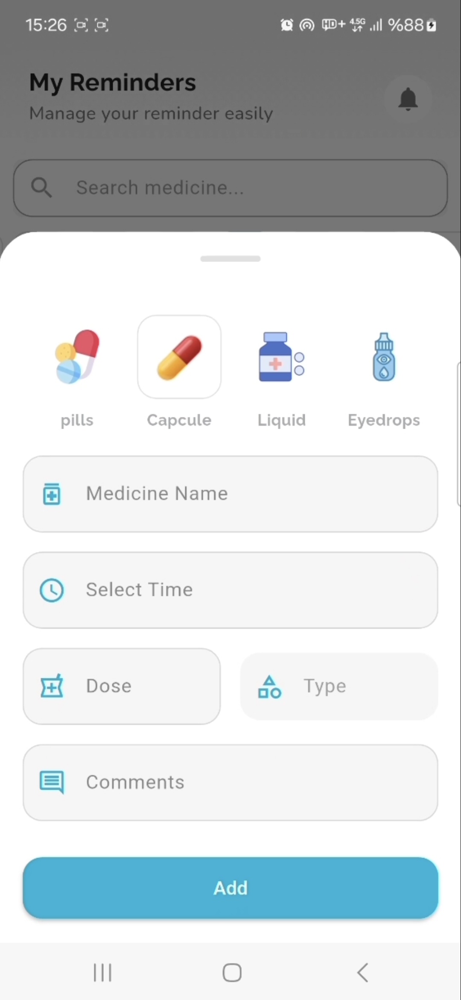
  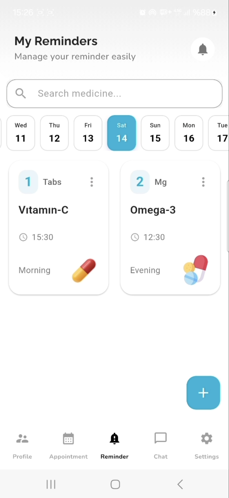
  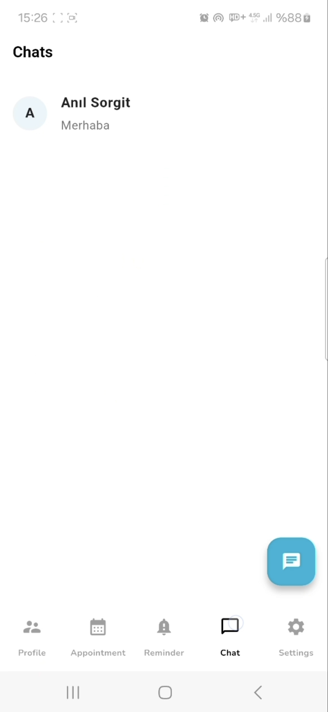

📱 Doktor Paneli

  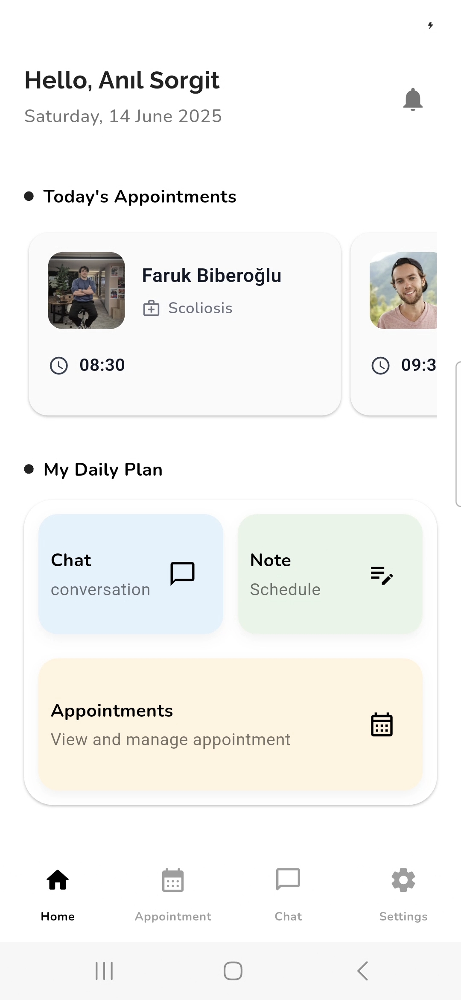
    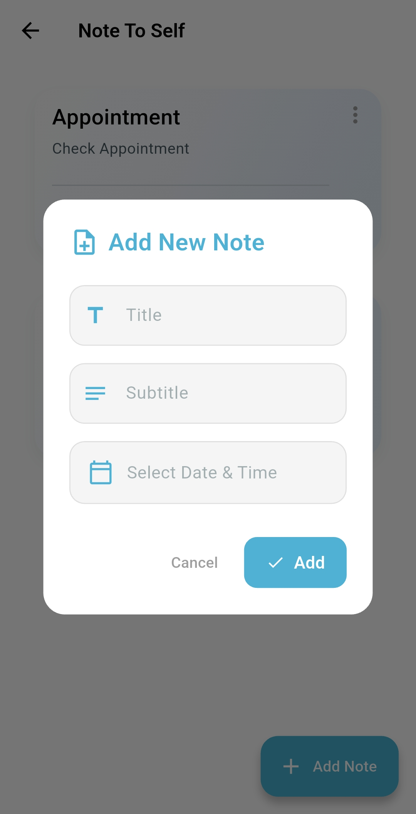
    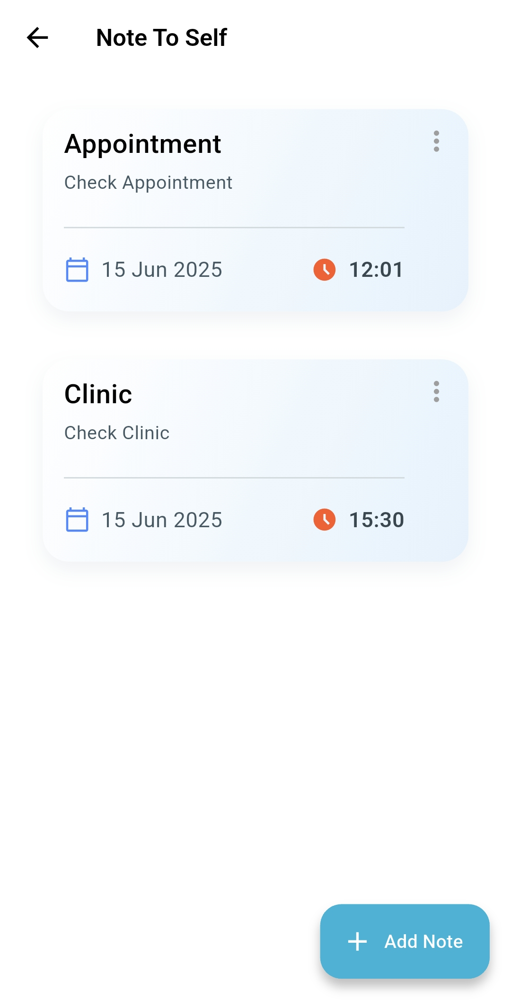
    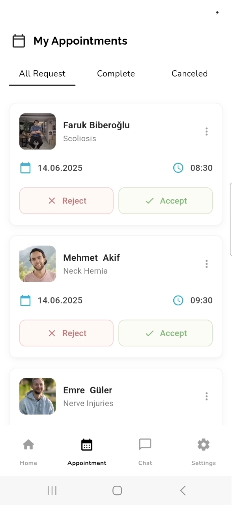
    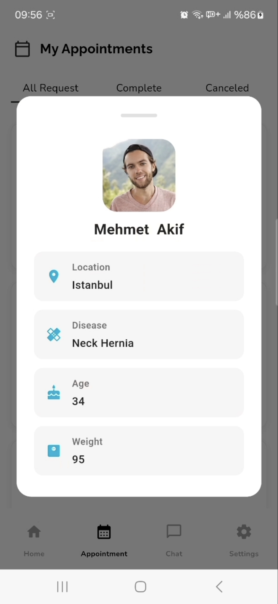

